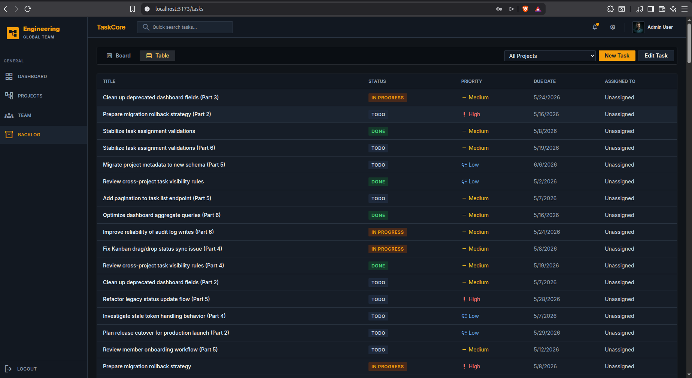
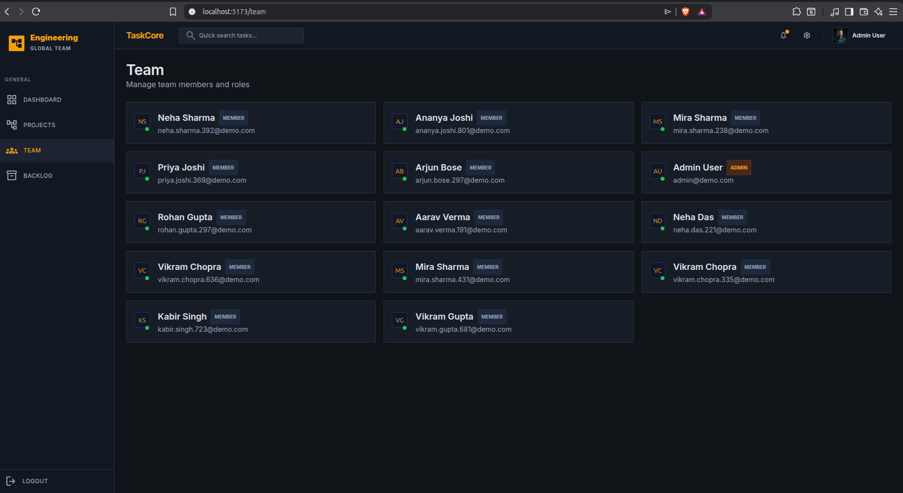
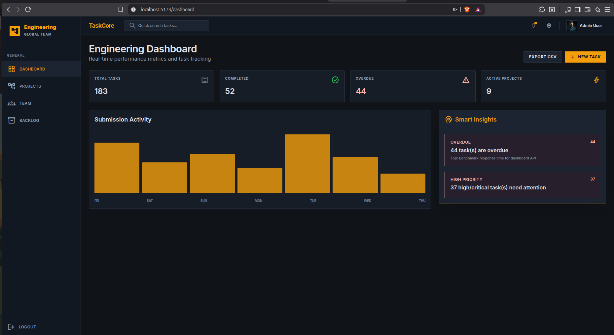

# TaskCore Office Project Manager

**TaskCore** is a modern, production-ready project and task management application designed for engineering and cross-functional teams. Built with the MERN stack (MongoDB, Express, React, Node.js), it delivers a sleek, dark-themed UI with powerful features to streamline workflows, track team productivity, and manage complex projects effortlessly.

### 🌐 Live Demo
**[task-core-office-project-manager.vercel.app](https://task-core-office-project-manager.vercel.app/)**

> ⚠️ **Important Note:** The backend is hosted on Render's free tier. If the server has been inactive, it spins down to save resources. When you first open the link, **data fetching may take approximately 1 minute** while the backend wakes up. Please be patient during the initial load!

---

## 📸 Application Screenshots

### Engineering Dashboard
Real-time performance metrics, 7-day submission activity graphs, and smart insights.


### Kanban Board
Intuitive task management with interactive status tracking (To Do, In Progress, Done).


### Table View
Clean tabular representation of tasks for quick scanning of priorities and due dates.


---

## ✨ Key Features

### 🎨 Frontend & UI/UX (React + Vite)
- **Premium Dark Aesthetic:** Modern, high-contrast dark mode design with glass-morphic elements and sleek TailwindCSS styling.
- **Dynamic Dashboard:** Includes a 7-day Submission Activity graph (percentage-scaled CSS rendering) and Smart Insights for overdue/critical tasks.
- **Dual View Modes:** Seamlessly toggle between Kanban Board View and a traditional Data Table View for tasks without losing state.
- **Role-Based Access Control (RBAC):** UI dynamically adapts based on user roles (Admin vs. Member). Only admins can create projects, add members, or edit global tasks.
- **Export Capabilities:** Export dashboard metrics to CSV with a single click.

### ⚙️ Backend Architecture (Node.js + Express)
- **Secure Authentication:** JWT-based stateless authentication with password hashing (Bcrypt).
- **RESTful API:** Clean API structure with robust error handling, centralized routing, and environment-aware configurations.
- **Data Integrity:** Mongoose schemas with strict validations for Projects, Tasks, and Users.
- **Advanced Aggregation:** MongoDB aggregation pipelines are used to dynamically calculate historical task activity and completion metrics for the dashboard.
- **Production Hardened:** Protected routes, configurable CORS explicitly mapped to frontend clients, and environment-guarded seeders to prevent accidental data overwrites.

### 🛡️ Security & Scalability
- **Environment Isolation:** Sensitive credentials (`MONGO_URI`, `JWT_SECRET`) are strictly maintained in `.env`.
- **Intelligent Queries:** Query filters automatically enforce user-level data isolation so standard members only ever receive data for projects they belong to.

---

## 🛠️ Technology Stack

**Frontend:**
- React 18 (Bootstrapped with Vite)
- Tailwind CSS
- React Router DOM
- Axios (with centralized interceptors)

**Backend:**
- Node.js & Express.js
- MongoDB & Mongoose
- JSON Web Token (JWT)

---

## 🚀 Getting Started

### Prerequisites
- Node.js (v16+ recommended)
- MongoDB Cluster (Atlas) or Local MongoDB Instance

### 1. Clone the repository
```bash
git clone <repository-url>
cd TaskCore_OfficeProjectManager
```

### 2. Backend Setup
```bash
cd backend-server
npm install
```
Create a `.env` file in the `backend-server` directory:
```env
PORT=5000
MONGO_URI=your_mongodb_connection_string
JWT_SECRET=your_super_secret_jwt_key
CLIENT_ORIGIN=http://localhost:5173
NODE_ENV=development
```
*Optional: Seed the database with sample data*
```bash
node utils/seeder.js
```
Start the backend server:
```bash
npm run dev
```

### 3. Frontend Setup
```bash
cd ../frontend-react
npm install
```
Create a `.env` file in the `frontend-react` directory:
```env
VITE_API_URL=http://localhost:5000
```
Start the frontend development server:
```bash
npm run dev
```

### 4. Open Application
Navigate to `http://localhost:5173` in your browser. 
If you ran the seeder, you can log in using:
- **Email:** `admin@demo.com`
- **Password:** `123456`

---

## 🚢 Deployment

The application is fully configured for cloud deployment.
- **Backend:** Recommended for Render or Heroku. Ensure `NODE_ENV` is set to `production` and `CLIENT_ORIGIN` matches your frontend domain to satisfy CORS.
- **Frontend:** Recommended for Vercel or Netlify. Build command is `npm run build` and output directory is `dist`. Ensure `VITE_API_URL` points to your deployed backend.

---

*Built with ❤️ for modern engineering teams.*
